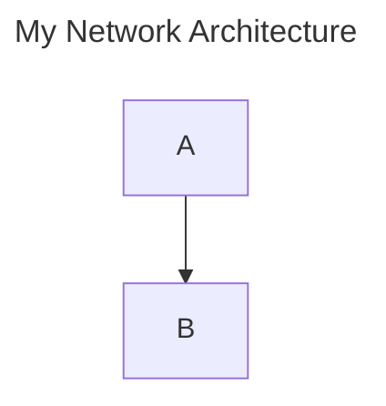
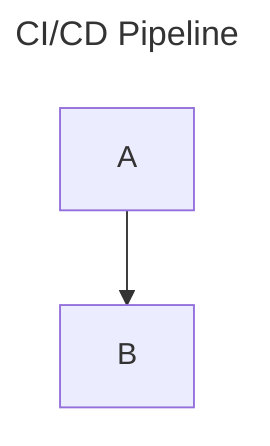

# Mermaid Block to Image - Obsidian Plugin


Convert Mermaid code blocks to static image URLs (SVG, PNG, or WebP) using the free **Kroki** or **Mermaid.ink** APIs, and restore them back to editable code blocks instantly. This speeds up note loading, keeps your vault clutter-free, and ensures consistent rendering across devices.


---

## Key Features

- ⚡ **URL Conversion**: Convert any Mermaid block to a hosted image URL (Kroki or Mermaid.ink) in one click.
- 🔁 **Instant Restore**: The diagram code is embedded in the URL — restore it back to a code block anytime, no extra comments needed.
- 💾 **Direct Downloads**: Export diagrams as SVG, PNG, or WebP straight to your computer.
- 🎨 **Theme-Aware Rendering**: Automatically applies your Obsidian light or dark theme when rendering or downloading.
- 🖱️ **Hover Action Buttons**: Convert, download, or restore diagrams using buttons that appear on hover — no commands needed.
- 📏 **Drag-to-Resize**: Drag the edge of any converted image to resize it. Width is saved directly in the Markdown link (``).

---

## How It Works

### 1. Active Diagram
You start with a standard Mermaid code block:

````markdown

````

### 2. Convert to URL
Click the **Convert to URL** hover button or right-click and select **Convert to URL**. The block is replaced by a clean markdown image link containing the compressed diagram code:
```markdown

```

### 3. Restore to Code Block
When you want to edit the diagram, click the **Restore URL to Mermaid** button (indicated by the history icon ↩️) or right-click the image and select **Restore URL to Mermaid**. The diagram code is decoded directly from the URL and restored back to a clean code block!

> [!TIP]
> **Use diagram metadata to control naming, sizing, and alt text**
> Add a title and/or width to your diagrams to control how they are converted and displayed. See the [Diagram Metadata](#diagram-metadata) section below for the full syntax reference.

---

## Usage

### In Live Preview & Reading Mode (Hover Buttons)
- **Active Blocks**: Hover over any Mermaid block to see two buttons:
  - **Convert to URL** (image icon): Replaces the block with a remote image URL.
  - **Download image** (download icon): Downloads the diagram to your computer.
- **Converted Images**: Hover over any converted diagram image to see:
  - **Restore URL to Mermaid** (history/revert icon): Restores the image link back to a Mermaid code block.
  - **Download image** (download icon): Downloads the diagram to your computer.
  - **Resize Handle**: Click and drag the border handle at the right/bottom-right edge of the image to adjust its width, showing a real-time pixel tooltip. Persists the size in standard markdown layout syntax (e.g. ``).


### In Source Mode & Context Menu
- Right-click an active Mermaid code block to select:
  - **Download image**
  - **Convert to URL**
- Right-click a converted image link (``) to select:
  - **Restore URL to Mermaid**


### Command Palette
Open the Command Palette (`Ctrl/Cmd + P`) and run:
- `Mermaid Block to Image: Download image`
- `Mermaid Block to Image: Convert to URL`
- `Mermaid Block to Image: Restore URL to Mermaid`

---

## Diagram Metadata

You can embed metadata directly inside your Mermaid code block to control the **title**, **file name**, and **initial display width** of any converted diagram. The plugin reads this before conversion and applies it automatically.

### Title

The title is used as the **alt text** of the generated image link and as the **file name** when downloading. Without a title, the plugin falls back to `Mermaid Diagram` and a generic hash for file names.

> [!IMPORTANT]
> **Always use YAML frontmatter to set the title.** It is the most reliable syntax and works consistently across all diagram types and Mermaid versions.

**Recommended — YAML frontmatter:**
````markdown

````
Result: ``  
Download: `my-network-architecture.png`


### Initial Width

Set a default display width for the image at conversion time. The plugin embeds it in the alt text as ``, which Obsidian uses to size the image. You can always adjust it later with the [drag-to-resize handle](#in-live-preview--reading-mode-hover-buttons).

**YAML frontmatter:**
````markdown

````

> [!NOTE]
> Width values are in pixels. If omitted, the default is `500px`. Percentage values (e.g. `width: 100%`) are also accepted and will use a fixed `1200px` API width for rendering.

---

## Settings & Configuration

To customize the plugin, go to **Settings** ➔ **Mermaid Block to Image**:

- **Download image format**: Choose between SVG, PNG, or WebP for direct downloads.
- **Mermaid theme**: Choose which theme to apply to rendered diagrams (Default, Dark, Forest, Neutral, Base, or Match Obsidian Theme).
- **URL service provider**: Select whether to use the official **Mermaid.ink** service or the **Kroki.io** service.
- **URL image format**: Choose the image type used for generated links (PNG or WebP).
- **Custom server URL**: Configure a custom self-hosted instance of Kroki or Mermaid.ink for complete privacy and offline setups.

---

## Installation

1. Open Obsidian and go to **Settings** ➔ **Community plugins**.
2. Click **Browse** and search for **Mermaid Block to Image**.
3. Click **Install**, then click **Enable**.

---

## Support

If you encounter any issues or have feature requests, please open an issue on [GitHub](https://github.com/jcmexdev/obsidian-mermaid-block-to-image).
